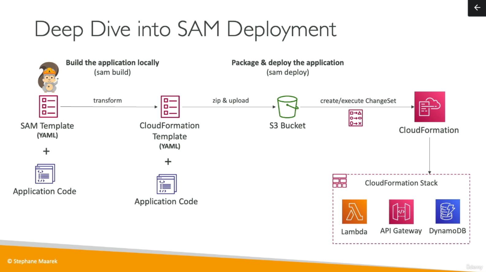
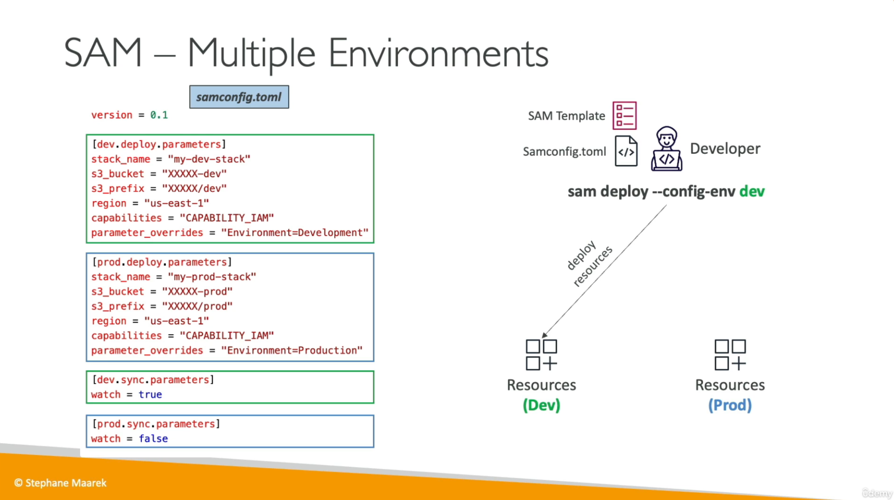

# SAM

## Transform Header indicates it's SAM template

```yaml
Transform: 'AWS::Serverless-2016-10-31'
```

## Write Code
- `AWS::Serverless::Function`    // lambda
- `AWS::Serverless::Api`         // api gateway
- `AWS::Serverless::SimpleTable` // dynamo db

## Package & Deploy

- `sam package` // optional
- `sam deploy`

## Quickly sync local changes to AWS Lambda (SAM Accelerate)
`
sam sync --watch
`

## SAM Deployment



## SAM Accelerate (sam sync)

- SAM Accelerate is a set of features to reduce latency while deploying resources to AWS
- `sam sync`
  - Synchronizes your project declared in SAM templates to AWS
  - Synchronizes code changes to AWS without updating infrastructure (uses service APIs & bypass CloudFormation)

- `sam sync` (no options)
  - Synchronizes code and infrastructure
- `sam sync --code`
  - Synchronizes code changes without updating infrastructure (bypass CloudFormation, update in seconds)
- `sam sync --code --resource AWS::Serverless::Function`
  - Synchronizes only all Lambda functions and their dependencies
- `sam sync --code --resource-id HelloWorldLambdaFunction`
  - Synchronizes only a specific resource by its ID
- `sam sync --watch`
  - Monitor for file changes and automatically synchronize when changes are detected
  - If changes include configuration, it uses `sam sync`
  - If changes are code only, it uses `sam sync --code`


## Initializing a SAM project

- `sam init -h` // help
- `sam init --name sam-app --runtime dotnet8`

## Example apps

`
https://github.com/amazon-archives/serverless-app-examples/tree/master/python/hello-world-python3
`

`
https://github.com/amazon-archives/serverless-app-examples/tree/master/python/hello-world-python3
`

`
https://github.com/amazon-archives/serverless-app-examples/tree/master/python/microservice-http-endpoint-python3
`

## SAM Policy Templates

- List of templates to apply permissions to your Lambda Functions
- `https://docs.aws.amazon.com/serverless-application-model/latest/developerguide/serverless-policy-templates.html`
- Important examples:
  - `S3ReadPolicy:` Gives read only permissions to objects in S3
  - `SQSPollerPolicy:` Allows to poll an SQS queue
  - `DynamoDBCrudPolicy: ` Gives create, read, update and delete permissions on dyanmodb

### Policy Template Example
```yaml
MyFunction:
  Type: 'AWS::Serverless::Function'
  Properties:
    CodeUri: ${codeuri}
    Handler: hello.handler
    Runtime: python3.9
    Policies:
      - SQSPollerPolicy:
        QueueName:
          !GetAtt MyQueue.QueueName
```

## SAM - Local Capabilities
- Locally start AWS Lambda
  - `sam local start-lambda`
  - Starts a local endpoint that emulates AWS Lambda
  - Can run automated tests against this local endpoint

## Locally Invoke Lambda Function
- `sam local invoke`
- Invoke Lambda function with payload once and quit after invocation completes
- Helpful for generating test cases
- If the function make API calls to AWS, make sure you are using the correct `--profile` option

## Locally Start an API Gateway Endpoint
- `sam local start-api`
- Starts a local HTTP server that hosts all your functions
- Changes to functions are automatically reloaded

## Generate AWS Events for Lambda Functions
- `sam local generate-event`
- e.g. and then pipe event into lambda function
- `sam local generate-event s3 put --bucket <bucket> --key <key> | sam local invoke -e -<function_logical_id>`
- Generate sample payloads for event sources
- S3, API Gateway, SNS, Kinesis, DyanmoDB...

## SAM - Multiple Environments



## Other resources

The Complete AWS SAM Workshop
`
https://catalog.workshops.aws/complete-aws-sam/en-US/module-1-sam-setup/30-template
`

Install dot net 8 on ubuntu
`
https://learn.microsoft.com/en-us/dotnet/core/install/linux-ubuntu-install?tabs=dotnet8&pivots=os-linux-ubuntu-2204
`